== Configuration du plugin

Après téléchargement du plugin, il vous suffit juste d'activer celui-ci, il n'y a aucune configuration supplémentaire à ce niveau là.

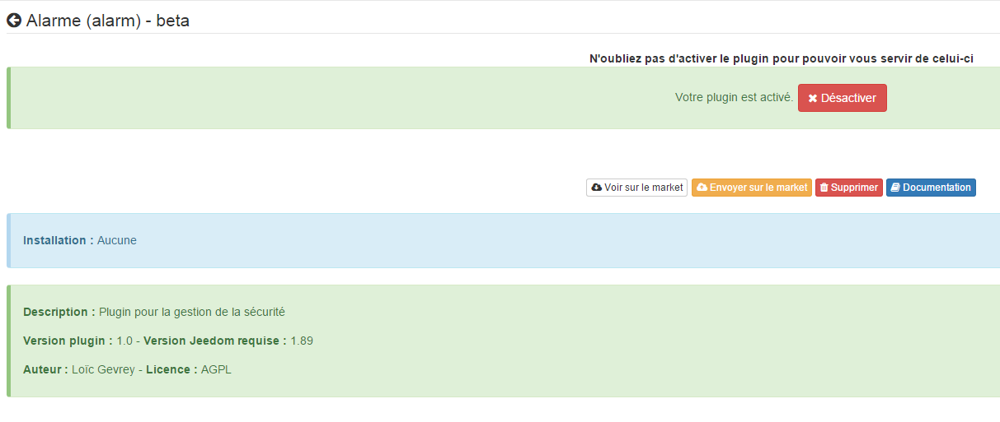

== Configuration des équipements

La configuration des équipements Alarme est accessible à partir du menu plugin : 

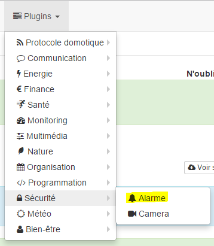

Voilà à quoi ressemble la page du plugin Alarme (ici avec déjà 1 équipement) : 

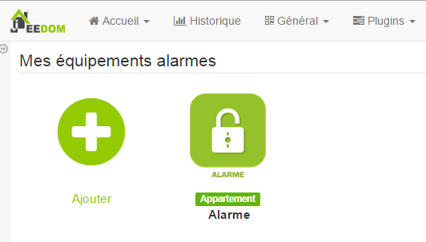

[TIP]
Comme à beaucoup d'endroits sur Jeedom, placer la souris tout à gauche permet de faire apparaître un menu d'accès rapide (vous pouvez, à partir de votre profil, le laisser toujours visible).

Une fois que vous cliquez sur l'un des équipements, vous obtenez : 

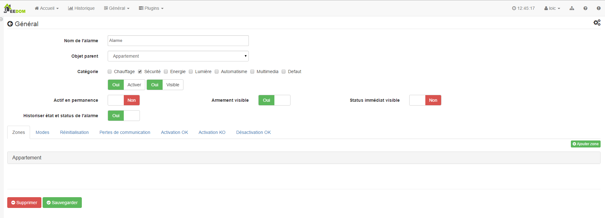

Vous retrouvez ici toute la configuration de votre équipement : 

* *Nom de l'équipement alarme* : nom de votre alarme,
* *Objet parent* : indique l'objet parent auquel appartient l'équipement,
* *Catégorie* : la catégorie de l'équipement (sécurité en général pour une alarme),
* *Activer* : permet de rendre votre équipement actif,
* *Visible* : rend votre équipement visible sur le dashboard,
* *Actif en permanence* : indique que l'alarme sera en permanence active (par exemple pour une alarme de détection d'incendie),
* *Armement visible* : permet de rendre visible ou non la commande d'armement de l'alarme sur le widget,
* *Statut immédiat visible* : permet de rendre le statut immédiat de l'alarme visible (voir plus bas pour l'explication),
* *Historiser état et statut de l'alarme* : permet d'historiser ou non l'état et le statut de l'alarme.

== Notion immédiate

C'est une notion très importante sur le plugin alarme et il est important de bien la bien comprendre. Pour schématiser c'est comme si vous aviez 2 alarmes, la première : l'alarme immédiate qui ne tient pas compte des délais de déclenchement (attention elle prend bien en compte les délais d'activation) et une 2ème alarme qui, elle, prend en compte les délais de déclenchement.

*Pourquoi cette notion immédiate ?*

Cette notion immédiate permet de déclencher des actions bien spécifiques. Par exemple : vous rentrez chez vous et vous n'avez pas désactiver l'alarme, avant de déclencher la sirène il peut être bon de diffuser un message rappellant de bien désactiver l'alarme et si ce n'est pas fait 1 minute plus tard (délai d'activation de 1 minute donc) d'activer la sirène.

Cette notion se retrouve dans différents types d'actions, à chaque fois son principe sera détaillé.

== Zones

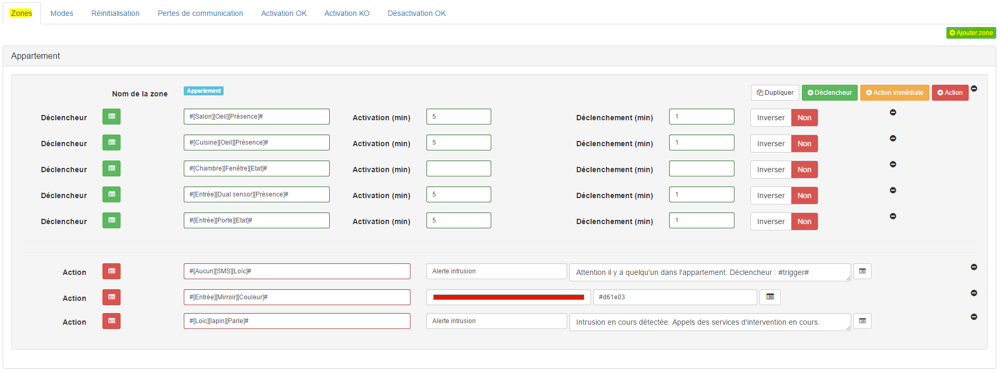

Partie principale de l'alarme. C'est ici que vous configurez les différentes zones et les actions (immédiates et différées) à faire en cas de déclenchement. Une zone peut aussi bien être volumétrique (pour la journée par exemple) que périmétrique (pour la nuit) ou aussi des zones de la maison (garage, chambre, dépendances....). 

Un bouton en haut à droite vous permet d'en ajouter autant que vous voulez.

[TIP]
Il est possible d'éditer le nom de la zone en cliquant sur le nom de celle-ci (en face du label "Nom de la zone").

Une zone est constituée de différents éléments : 
- déclencheur,
- action immédiate,
- action.

=== Déclencheur

Un déclencheur est une commande binaire, qui lorsqu'elle vaut 1 va déclencher l'alarme. Il est possible d'inverser le déclencheur, pour que ça soit l'état 0 du capteur qui déclenche l'alarme, en mettant "inverser" sur OUI.
Une fois votre déclencheur choisi, vous pouvez spécifier un délai d'activiation en minute (il n'est pas possible de descendre en-dessous de la minute). Ce délai permet par exemple, si vous activer l'alarme avant de sortir de chez vous, de ne pas déclencher l'alarme avant une minute (le temps de vous laisser sortir). Autre cas, certains détecteurs de mouvement restent en mode déclenché (valeur 1) pendant un certain temps même si il n'y a aucune détection, par exemple 4 minutes, il est donc bon de décaler l'activation de ces capteurs de 4 ou 5 min pour que l'alarme ne se déclenche pas immédiatement après l'activation.
Ensuite vous avez le délai de déclenchement, à la difference du délai d'activation qui n'a lieu que une fois lors de l'activation de l'alarme, celui-ci est mis en place après chaque déclenchement d'un capteur. La cinématique est la suivante lors du déclenchement du capteur (ouverture de porte, détection de présence), si les délais d'activation sont passés,  l'alarme va déclencher les actions immédiates mais va attendre que le délai d'activation soit fini avant de déchencher les actions.
Enfin vous avez le bouton "inverser" qui permet d'inverser l'état déclencheur du capteur (0 au lieu de 1).

Petit exemple pour bien comprendre : sur le premier déclencheur (#[Salon][Oeil][Présence]#) j'ai ici un délai d'activation de 5 minutes et de déclenchement de 1 minute. Cela veut dire que lorsque j'active l'alarme, pendant les 5 premières minutes aucun déclenchement de l'alarme ne pourra avoir lieu à cause de ce capteur. Passé ce délai de 5 minutes, si un mouvement est détecté par le capteur, l'alarme va attendre 1 minute (le temps de me laisser désactiver l'alarme) avant de déclencher les actions. Si j'avais eu des actions immédiates celles-ci se seraient déclenchées immédiatement sans attendre la fin du délai d'activation, les actions non immédiates auraient eu lieu après (1 minute après les actions immédiates).

=== Action immédiate

Comme décrit plus haut, ce sont des actions qui se déclenchent dès le déclenchement en ne tenant pas compte du délai de déclenchement (mais en tenant compte quand même du délai d'activation). Vous avez juste à sélectionner la commande d'action voulue puis en fonction de celle-ci remplir les paramètres d'exécution.

[NOTE]
Lorsque plusieures zones sont déclenchées successivement, seules les actions immédiates de la 1ere zone déclenchée sont exécutées.

== Modes

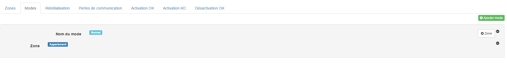

Les modes sont assez simples à configurer, il suffit juste d'indiquer les zones actives en fonction du mode.

[TIP]
Il est possible de renommer le mode en cliquant sur le nom de celui-ci (en face du label "Nom du mode").

[NOTE]
Lors du renommage d'un mode, il faut sur le widget de l'alarme recliquer sur le mode en question pour une prise en compte complete (sinon jeedom reste sur l'ancien mode)

=== Réinitialisation

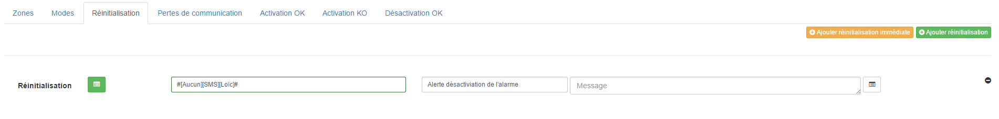

Cette partie vous permet de définir les actions à faire lorsque l'alarme est déclenchée puis désactivée. Ici aussi il y a des actions immédiates et différées. Voici un exemple : vous rentrez chez vous, les délais d'activation sont passés, mais en ouvrant la porte cela déclenche l'alarme. Si vous la désactiver (avant les délais de déclenchement) alors les actions de réinitialisation immédiate seront exécutées, mais pas celles de réinitialisation normale. Si vous la désactivez après les délais de déclenchement, alors les actions de réinitialisation immédiate et normale seront exécutées.

== Activation OK

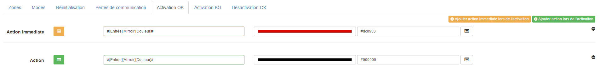

Cette partie permet de définir les actions à faire suite à une activation de l'alarme. Ici encore, vous retrouverez la notion immédiate qui représente les actions à faire toute de suite après armement de l'alarme, ensuite viennent les actions d'activation qui elles sont exécutées après les délais de déclenchement. 

Dans l'exemple, ici j'allume par exemple une lampe en rouge pour signaler que l'armement a bien été pris en compte et je l'éteinds une fois l'armement complet (car normalement il n'y a plus personne dans le périmètre de l'alarme, sinon ça la déclenche).

[IMPORTANT]
Les actions d'activation OK ne prennent pas en compte les délais d'activation. Si vous avez un délai sur l'activation d'un capteur d'ouverture, même si votre porte est ouverte les actions d'activation seront exécutées.

== Activation KO

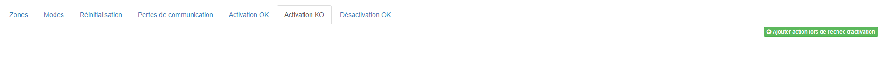

Ces actions sont exécutées si un capteur est déclenché et que celui-ci n'a pas de délai d'activation. Il est à noter que dans ce cas les actions de déclenchement immédiates seront aussi exécutées. La différence entre les deux, c'est que les actions d'activation KO ne peuvent être exécutées que lors de l'activation.

== Désactivation OK

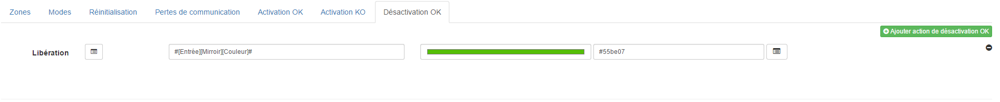

Ces actions sont exécutées lorsque l'alarme est désactivée et qu'elle n'est pas déclenchée. Exemple vous rentrez chez vous, en ouvrant la porte cela déclenche l'alarme, mais vous avez mis un délai de déclenchement sur le capteur et vous coupez l'alarme avant la fin du délai, les actions de désactivation OK seront exécutées. Si par contre vous aviez arrêté l'alarme après la fin de délai de déclenchement cela n'aurait pas été le cas.

== Widget

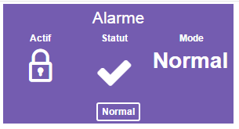

Voilà un exemple du widget, vous retrouvez dessus l'activation de l'alarme (ici actif), pour la désactiver il suffit de cliquer sur le cadenas. Le statut actuel, ici non déclenchée, ainsi que le mode, ici normal. En dessous, vous avez les boutons pour changer de mode si vous en avez plusieurs.

[TIP]
Si votre alarme est déclenchée et que vous cliquez sur un mode cela aura pour effet de la désactiver/réactiver.

Voilà un autre exemple de widget en fonction des différentes options :

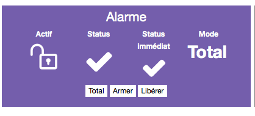
