Sur la page du plugin, vide, il faudra ajouter une Alarme via le bouton +. Il est en effet possible d'avoir plusieurs alarmes, par exemple pour la maison et pour une dépendance...Ou encore, on verra plus tard, pour l'alarme intrusion et l'alarme sécurité incendie...

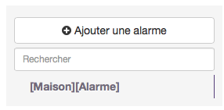

Une fois créée, s'affiche la page principale pour la configuration de l'alarme. En haut l'onglet général, et en bas la configuration de l'alarme.

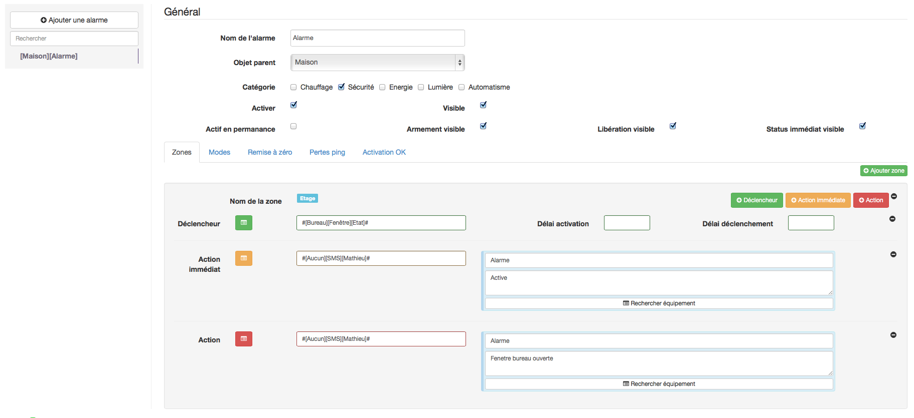

Dans la partie haute, onglet Général, On donnera un nom à l'alarme et une appartenance dans l'arborescence. On peut lui affecter une catégorie, puis avoir le choix de rendre actif ou visible l'alarme sur le dashboard.

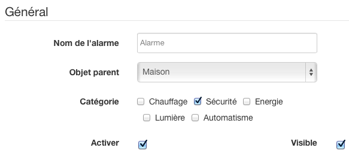

Ensuite diverses options sont possibles. Comme par exemple activer l'alarme en permanence, ce sera le cas par exemple pour les détecteurs de fumée, monoxyde ou inondation... Ou afficher sur le widget l'état de l'alarme (Armement, Libération, Status).

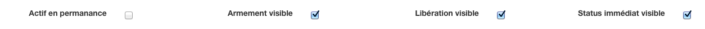

En dessous se trouve la partie configuration de l'alarme avec plusieurs onglets. On va les voir en détails.

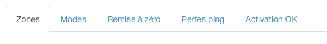

Le premier onglet, est l'onglet Zone. Elle permet de définir les zones de son alarme. Il est possible de définir autant de zones que l'on souhaite. Ces zones peuvent être par exemple, le Rez de chaussé, l'étage... Pour ajouter une zone il suffit de cliquer sur le bouton vert "Ajouter zone".

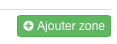

Dans chaque zone on pourra définir plusieurs éléments.

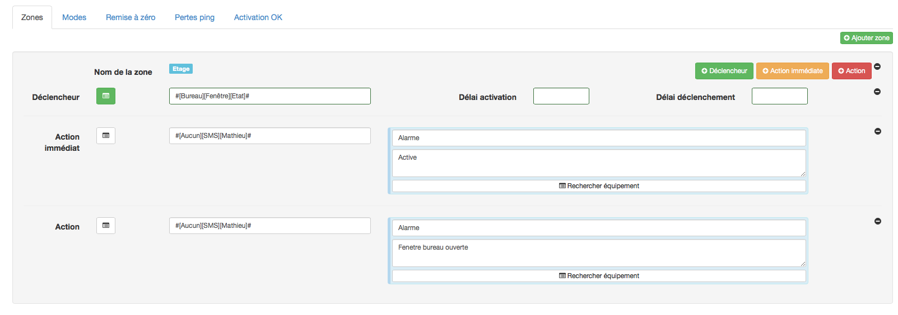

Pour cela on a 3 boutons qui permettent d'ajouter des éléments dans chaque zone. Les déclencheurs, les actions immédiates, et les actions.

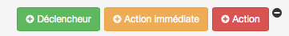

Les déclencheurs, ce sont les éléments domotiques qui seront succeptibles de déclencher une alarme dans la zone définie. Comme par exemple un détecteur d'ouverture.
Pour chaque déclencheur on pourra définir un délai d'activation, qui permettra par exemple d'avoir le temps de sortir de la maison après avoir activé l'alarme à l'intérieur: typiquement une porte d'entrée.
Et à l'inverse, un délai de déclenchement qui permettra d'avoir le temps de désactiver l'alarme avant que celle ci sonne... Exemple je rentre dans la maison par la porte d'entrée, la sirène ne se déclenche pas de suite pour me laisser le temps de désactiver l'alarme.

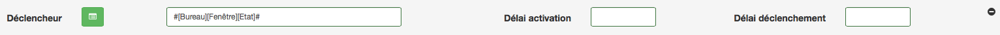

Ensuite pour chaque zone, on peut définir plusieurs actions immédiates. Ces actions seront lancées dès qu'un déclencheur sera actif pour cette zone sans tenir compte des délais, par exemple pour prévenir qu'on a oublié de fermer une fenêtre.

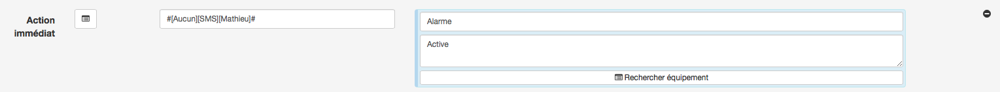

Et enfin les actions classiques. Celles si seront à réaliser lorsqu'un des déclencheurs configurés pour la zone sera actif. Ces actions tiendront compte des délais précédemment configurés pour chaque déclencheur. Ici lorsque je vais ouvrir la fenêtre cela va m'envoyer un SMS. On peut par exemple déclencher une sirène.

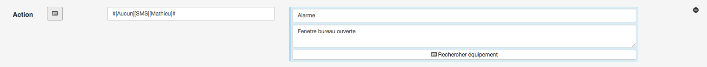

L'onglet Mode. On va pouvoir ici définir des modes à son alarme. Ce sont ces modes que l'on va activer dans l'alarme. Les modes sont un groupement de zones. Par exemple un mode "total" pour les zones Rdc+Etage, et un mode "partiel" pour la zone Etage

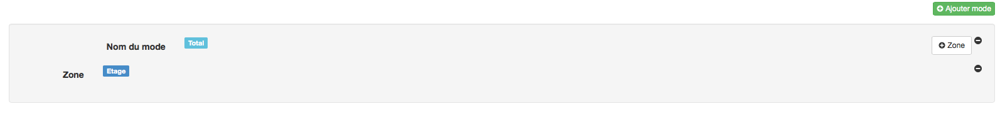

On va commencer par ajouter un Mode, à l'aide du bouton vert "Ajouter Mode". (on peut donner le nom que l'on souhaite au mode)

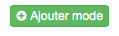

Puis pour chaque mode on va pouvoir ajouter autant de zone que l'on veut, via le bouton "+ Zone".

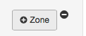

On voit ici que j'ai défini un mode "Total", avec dedans une zone "Etage".

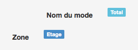

L'onglet RAZ.

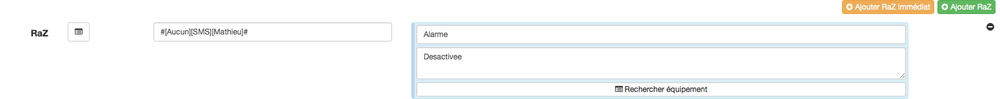

Il permet simplement d'ajouter des actions lorsque l'alarme sera désactivée. Via les boutons "Ajouter Raz", on ajoutera des actions lorsque l'alarme aura été désactivée, par exemple désactiver la sirène. La particularité du bouton "Raz immédiat" est de rajouter des actions immédiates sur déclenchement même si le déclenchement a un délai, par exemple pour signaler que l'alarme a détecté une intrusion sans faire sonner de suite la sirène.

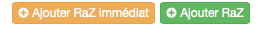

L'onglet Pertes de ping, permet simplement de détecter des brouillages radio lorsque l'alarme est active.

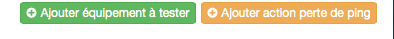

Enfin, l'onglet Activation OK va permettre d'avoir des actions dès que l'alarme aura été activée, pour par exemple prévenir par SMS que l'alarme s'est bien activée.

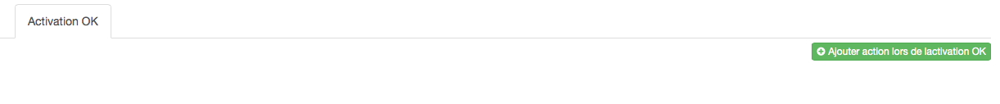

Voici ce que donne le plugin alarme configuré simplement, sur le Dashboard. Le choix du mode, l'armement et la libération de l'alarme. A noter que sur une alarme active en permanence il n'y a pas de bouton activer/desactiver pour la reinitialiser
il suffit de cliquer sur le mode en cours (ou autre), attention la reinitialisation par clique sur le mode ne marche que pour les alarmes activent en permanence.

image::../images/alarme23.png[]

Ici le plugin alarme combiné avec le plugin SMS.

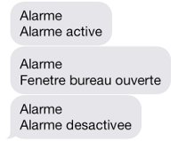

A noter, que pour toute la configuration, les déclencheurs et actions sont directement accessibles en cliquant sur le petit livre à côté du champ, on obtient une liste déroulante pour retrouver rapidement son équipement.

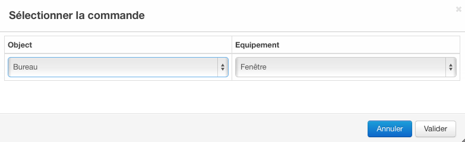

Ne pas oublier enfin, de sauvegarder une fois votre alarme configurée !
