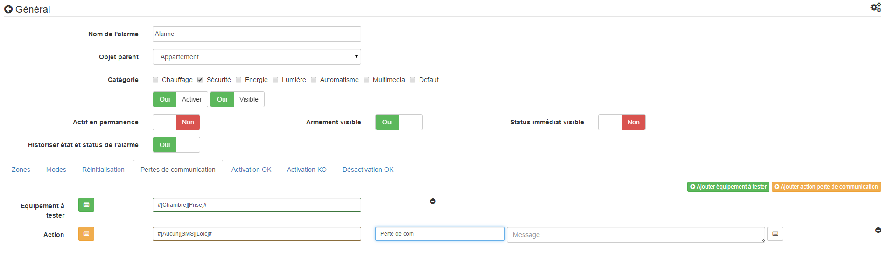

=== Configuration du plugin

Après téléchargement du plugin, il vous suffit juste d'activer celui-ci, il n'y a aucune configuration à ce niveau

image::../images/alarm1.png[]

=== Configuration des équipements

La configuration des équipements Alarme est accessible à partir du menu plugin : 

image::../images/alarm2.png[]

Voilà à quoi ressemble la page du plugin Alarme (ici avec déjà 1 équipement) : 

image::../images/alarm3.png[]

[icon="../images/plugin/tip.png"]
[TIP]
Comme à beaucoup d'endroits sur Jeedom, placer la souris tout à gauche permet de faire apparaître un menu d'accès rapide (vous pouvez, à partir de votre profil, le laisser toujours visible).

Une fois que vous cliquez sur l'un d'eux, vous obtenez : 

image::../images/alarm4.png[]

Vous retrouvez ici toute la configuration de votre équipement : 

* *Nom de l'équipement phonemarket* : nom de votre équipement Phonemarket,
* *Objet parent* : indique l'objet parent auquel appartient l'équipement.
* *Catégorie* : la categorie de l'équipement (sécurité en générale pour une alarme)
* *Activer* : permet de rendre votre équipement actif,
* *Visible* : rend votre équipement visible sur le dashboard,
* *Actif en permanence* : indique que l'alarme sera en permanance active (par exemple pour une alarme de detection d'incendie)
* *Armement visible* : permet de rendre visible ou non la commande d'armement de l'alarme sur le widget
* *Status immediat visible* : permet de rendre le status immediat de l'alarme visible (voir plus bas pour l'explication)
* *Historiser état et status de l'alarme* : permet d'historiser ou non l'état et le status de l'alarme

=== Notion immédiate

C'est une notion très importante sur le plugin alarme et il est important de bien de la bien comprendre pour schématiser c'est comme si vous avez 2 alarmes la premiere l'alarme immediate qui ne tient pas compte des délai de déclenchement (attention elle prend bien en compte les délais d'activation) et une 2eme une alarme qui prend en compte les délais de déclenchement.

*Pourquoi cette notion immédiate ?*

Cette notion immédiate permet de déclencher des actions bien spécifique, par exemple vous rentrez chez vous et vous n'avez pas désactiver l'alarme, avant de déclencher la sirene il peut etre bon de diffuser un message rappellant de bien desactiver l'alarme et si ce n'est pas fait 1 minute plus tard (délai d'activation de 1 minute donc) d'activer la sirene

Cette notion se retrouve dans differentes type d'actions, a chaque fois son principe sera détaillé

=== Zones

image::../images/alarm5.png[]

Partie principal de l'alarme c'est ici que vous configurez les differentes zone et les actions (immediates et differées) à faire en cas de déclenchement. Une zone peut aussi bien etre volumetrique (pour la journée par exemple) que périmetrique (pour la nuit) ou aussi des zones de la maison (garage, chambre, dependances....). 

Un bouton en haut à droite vous permet d'en ajouter autant que vous voulez

[icon="../images/plugin/tip.png"]
[TIP]
Il est possible d'éditer le nom de la zone en cliquant sur le nom de celle (en face du label "Nom de la zone")

Une zone est constituée de differents élements : 
- déclencheur
- action immediate
- action

==== Déclencheur

Un déclencheur est une commande binaire qui lorsqu'elle vaut 1 va déclencher l'alarme, il est bien sur possible de d'inverser le declencheur pour que ca soit quand l'état 0 du capteur qui declenche l'alarme en mettant inverser sur OUI.
Une fois votre declencheur choisir vous pouvez spécifier un délai d'activiation en minute (il n'est pas possible de descendre en dessous de la minute). Ce délai permet par exemple si vous activer l'alarme avant de sortir de chez vous de ne pas déclencher l'alarme avant une minute (le temps de vous laisser sortir). Autre cas certain detecteur de mouvement reste en mode déclenché (valeur 1) pendant un certain temps meme si il n'y a aucune detection, par exemple 4 min, il est donc bon de decaler l'activation de ces capteurs de 4 ou 5 min pour ne pas que l'alarme se déclenche immédiatement après l'activation
Ensuite vous avez le délai de déclenchement, à la difference du délai d'activation qui n'a lieu que une fois lors de l'activation de l'alarme, celui-ci est mise en place après chaque déclenchement d'un capteur. La cinematique est la suivante lors du déclenchement du capteur (ouverture de porte, détection de présence) l'alarme, si les délai d'activation sont passé, va déclencher les actions immédiate mais va attendre que le délai d'activation soit fini avant de déchencher les actions.
Enfin vous avez le bouton inverser qui permet d'inverser l'état déclencheur du capteur (0 au lieu de 1)

Petite exemple pour bien comprendre, sur le premier déclencheur (#[Salon][Oeil][Présence]#) j'ai ici un délai d'activation de 5min et de déclenchement de 1min. Cela veut dire que lorsque j'active l'alarme pendant les 5 premiers minutes aucun declenchement de l'alarme ne pourra avoir lieu a cause de ce capteur. Passé ce délai de 5min si un mouvement est detecté par le capteur alors l'alarme va attendre 1min (le temps de me laisser desactiver l'alarme) avant de declencher les actions. Si j'avais eu des actions immédiate par contre celle-ci se seraient déclenchée immédiatement sans attendre la fin du délai d'activation, ensuite les actions aurait eu lieu (1 minute donc après les actions immédiate)

==== Action immédiate

Comme décris plus c'est des actions qui se déclenche dès le declenchement en ne tenant pas compte du délai de déclenchement (mais en tenant compte quand meme du délai d'activation). Vous avez juste a séléctionner la commande d'action voulu puis en fonction de celle-ci remplir les parametres d'éxecution.

=== Modes

image::../images/alarm6.png[]

Les modes sont assez simple a configurer, il suffit juste d'indiquer les zones active en fonction du mode

[icon="../images/plugin/tip.png"]
[TIP]
Il est possible de renommer le mode en cliquant sur le nom de celui ci (en face du label "Nom du mode")

=== Réinitialisation

image::../images/alarm7.png[]

Cette partie vous permet de definir les actions a faire lorsque l'alarme est déclenchée puis désactiver. Ici aussi il y a des actions immédiates et differées. Voici un exemple : vous rentrez chez vous les délai d'activation sont passés, mais en ouvrant la porte ca déclenche l'alarme si vous la desactiver (avant les délai de declenchement) alors les action de reintialisation immédiate seront éxecutées mais pas celle de réinitialisation. Si vous la désactivez après les délai de délcenchement alors les actions de réinitlisation immédiate et normale seront éxecutées

=== Perte de communication

Dans cette partie vous allez pouvoir configurer un ping (verifie si le module est vivant) et les actions a faire en cas de perte du module. Attention il faut toujours tester un péripehrique alimenté (exemple une prise zwave) sous peine de voir la batterie de votre module se vider

=== Activation OK

image::../images/alarm9.png[]

Cette partie permet de definir les actions a faire suite à une activation de l'alarme. Ici encore on retrouve la notion immédiate qui représente les actions a faire toute de suite après armement de l'alarme, ensuite viennent les actions d'activation qui elles sont éxecuté après les délais de déclenchement. 

Dans l'exemple ici j'allume par exemple une lampe en rouge pour signalement que l'alarmement a bien été pris en compte et je l'éteints une fois l'armement complet (car normalement plus personne dans le périmetre de l'alarme, sinon ca la déclenche).

[icon="../images/plugin/important.png"]
[IMPORTANT]
Les action d'activation OK ne prennent pas en compte les délai d'activation. Si vous avez un délai sur l'activation d'un capteur d'ouverture, meme si votre porte est ouverte les action d'activation seront éxecutées

=== Activation KO

image::../images/alarm10.png[]

Ces actions sont executées si un capteur est déclencher et que celui-ci n'a pas de délai d'activation. Il est à noter que dans ce cas les actions de déclenchement immédiate seront aussi executées. La difference entre les 2 c'est que les actions d'activation KO ne peuvent etre executé que lors de l'activation

=== Désactivation OK

image::../images/alarm11.png[]

Ces actions sont executées lors que l'alarme est désactivé et quelle n'est pas déclenché. Exemple vous rentrès chez vous, en ouvrant la porte ca declenche l'alarme mais dessus le capteur vous avez mis un délai de déclenchement et vous coupez l'alarme avant la fin du délai, la les actions de désactivation OK sont éxecutée. Si par contre vous aviez arreté l'alarme après la fin de délai de déclenchement ca n'aurait pas été le cas.

=== Widget

image::../images/alarm12.png[]

Voila un exemple du widget, vous retrouver dessus l'activation de l'alarme (ici actif), pour la désactiver il suffit de cliquer sur le cadenas. Le statut actuel, ici non déclenchée, ainsi que le mode, ici normale. En dessous vous avez les boutons pour changer de mode si vous en avez plusieurs.

[icon="../images/plugin/tip.png"]
[TIP]
Si votre alarme est déclenchée et que vous cliquer sur un mode cela aura pour effet de la desactiver/reactiver

Voila un autre exemple de widget en fonction des differentes options :

image::../images/alarm_screenshot3.png[]